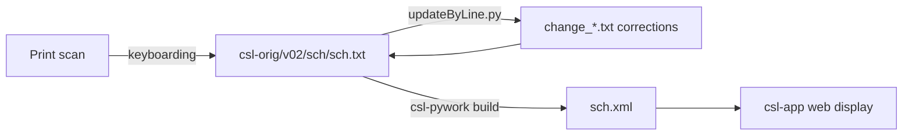

# SCH — Schmidt *Nachträge zum Sanskrit-Wörterbuch* (1928)

_Created: 15-05-2026 · Last updated: 11-07-2026_

Development and correction repository for **Richard Schmidt's *Nachträge zum
Sanskrit-Wörterbuch in kürzerer Fassung***, a supplement continuing the
abridged Petersburg dictionary (PWK) with 28,455 additional entries and
citations, part of the [Cologne Digital Sanskrit Lexicon](https://www.sanskrit-lexicon.uni-koeln.de/)
(CDSL).

---

## Why this repo exists

The canonical source text lives in
[`csl-orig/v02/sch/sch.txt`](https://github.com/sanskrit-lexicon/csl-orig/blob/master/v02/sch/sch.txt)
and is never edited directly — corrections are prepared here as scripted,
auditable line-level changes, then applied and pushed upstream in a batch.
This repo holds the actual working history of that process: the scripts
that found ~30,000 markup errors and fixed them, the intermediate `temp_*`
files documenting each pass, and the per-issue folders for larger campaigns
(e.g. adding `<ls>` literary-source markup, fixing citation abbreviations,
Greek-script cleanup).

Concretely, this is where the answer to "why does entry N in SCH look the
way it does" is worked out and recorded, not just "corrected in place."

---

## Contents

| Path | Purpose |
|---|---|
| [`greek/`](https://github.com/sanskrit-lexicon/SCH/tree/main/greek) | Greek-script encoding correction pass |
| [`ls/`](https://github.com/sanskrit-lexicon/SCH/tree/main/ls) | `<ls>` literary-source-citation markup campaign — the largest single effort (~30,000 lines changed), with the full worked log in [`ls/readme.txt`](https://github.com/sanskrit-lexicon/SCH/blob/main/ls/readme.txt) |
| [`schissues/`](https://github.com/sanskrit-lexicon/SCH/tree/main/schissues) | Per-issue correction workflows (`issue10/`, …) |
| [`schmidt_orig_utf8.txt`](https://github.com/sanskrit-lexicon/SCH/blob/main/schmidt_orig_utf8.txt) | Earliest tracked UTF-8 transcription of Schmidt's text (28,763 lines) — historical baseline, not the current canonical source |
| [`SCH-Nachtraege.doc`](https://github.com/sanskrit-lexicon/SCH/blob/main/SCH-Nachtraege.doc) / [`.htm`](https://github.com/sanskrit-lexicon/SCH/blob/main/SCH-Nachtraege.htm) / [`.pdf`](https://github.com/sanskrit-lexicon/SCH/blob/main/SCH-Nachtraege.pdf) | Front-matter / preface material |
| [`DATA_DICTIONARY.md`](https://github.com/sanskrit-lexicon/SCH/blob/main/DATA_DICTIONARY.md) | Markup tag reference |
| [`CLAUDE.md`](https://github.com/sanskrit-lexicon/SCH/blob/main/CLAUDE.md) | Repository guide for Claude Code agents |

---

## Usage: applying a line-level correction (verified runnable)

Every correction in this repo — and across the org — goes through
[`updateByLine.py`](https://github.com/sanskrit-lexicon/SCH/blob/main/ls/updateByLine.py): apply a change file of paired
`N old …` / `N new …` (or `ins`/`del`) lines against a source text, and get
a corrected copy plus a change-count summary.

Below is a real, minimal example run against this repo's own
[`schmidt_orig_utf8.txt`](https://github.com/sanskrit-lexicon/SCH/blob/main/schmidt_orig_utf8.txt) — line 5 originally reads:

```
number after € indicates number of lines in entry
```

Change file (`change_demo.txt`, UTF-8, no BOM):

```
5 old number after € indicates number of lines in entry
5 new number after € indicates number of lines in each entry
```

Run:

```sh
python ls/updateByLine.py schmidt_orig_utf8.txt change_demo.txt schmidt_demo_out.txt
```

Actual output (11-07-2026, this checkout):

```
28763 lines read from schmidt_orig_utf8.txt
28763 records written to schmidt_demo_out.txt
1 change transactions from change_demo.txt
1 of type new
```

And line 5 of `schmidt_demo_out.txt` reads:

```
number after € indicates number of lines in each entry
```

`updateByLine.py` also supports `ins` (insert after a line) and `del`
(delete a line) in place of `new` — see the docstring at the top of
[`ls/updateByLine.py`](https://github.com/sanskrit-lexicon/SCH/blob/main/ls/updateByLine.py) for the exact syntax.

### The real campaign this pattern powered

[`ls/readme.txt`](https://github.com/sanskrit-lexicon/SCH/blob/main/ls/readme.txt) is the worked log of the largest actual
correction pass in this repo: adding `<ls>` literary-source markup across
all 29,123 entries. It ran `change_ls1.py` iteratively against a growing
abbreviation list (`front.txt`), producing successive `temp_sch_N.txt`
snapshots, and ultimately applied **~30,000** individual line changes via
exactly the `updateByLine.py` invocation shown above, before the corrected
file was copied back into `csl-orig` and XML-validated with
`generate_dict.sh` / `xmlchk_xampp.sh`.

---

## Timeline

| Period | Activity |
|---|---|
| 2014 | Repository activity begins (first tracked issues) |
| 2017–2024 | Ongoing corrections, markup, and comparison work |
| 2026-05 | Issue taxonomy, citation metadata, documentation |

---

## Projects & Milestones

| Milestone | Open | Closed | Total |
|---|---|---|---|
| Dictionary to Book | 0 | 0 | 0 |
| Digitization Quality | 0 | 2 | 2 |
| Structured Data | 1 | 5 | 6 |
| Major Enhancements | 3 | 1 | 4 |
| **Total** | **4** | **8** | **12** |

### Open

| # | Title | Type | Severity | Milestone |
|---|---|---|---|---|
| 4 | 12427 (º) & 3148 (*) Entries | question | minor | Structured Data |
| 6 | Preface, Partial translation | content-enhancement | medium | Major Enhancements |
| 9 | SCH -- AB version for adopting into CDSL system | content-enhancement | medium | Major Enhancements |
| 12 | docs-pass: SCH documentation review | content-enhancement | medium | Major Enhancements |

### Solved

| # | Title | Type | Severity | Milestone |
|---|---|---|---|---|
| 1 | Anglicized Sanskrit Coding Scheme | encoding | minor | Digitization Quality |
| 2 | SCH-Nachträge | content-enhancement | medium | Major Enhancements |
| 3 | [Schµ793] €1 | markup | minor | Structured Data |
| 5 | Changes to sch.txt and sch.xml | markup | minor | Structured Data |
| 7 | greek text | encoding | minor | Digitization Quality |
| 8 | ls markup | markup | minor | Structured Data |
| 10 | BHĀGAVATAPURĀṆA SCH literary source markup | markup | minor | Structured Data |
| 11 | [markup] Minor sch.txt Markup Oddities | markup | minor | Structured Data |

---

## Labels

### Type labels

| Label | Meaning |
|---|---|
| `link-target` | Click-throughs from `<ls>` abbreviations to scanned PDF pages |
| `link-splitting` | Splitting combined `SOURCE N,N` refs into per-page links |
| `markup` | Normalising XML tag content |
| `text-correction` | Corrections to German/Sanskrit definitions or headwords |
| `content-enhancement` | New material or structural additions beyond correction |
| `encoding` | SLP1/IAST transcoding, character normalisation |
| `scan-quality` | Replacing blurry/skewed/missing scan pages |
| `bug` | Broken links, XML errors, broken downloads |
| `question` | Scholarly questions requiring research |

### Severity labels

| Label | Meaning |
|---|---|
| `minor` | Targeted fix — a handful of lines or a single file |
| `medium` | Standard unit of work — one batch of corrections |
| `hard` | Large effort spanning many sources or files |

---

## Contributors

| Contributor | Commits |
|---|---|
| gasyoun (Mārcis Gasūns) | 33 |
| funderburkjim | 17 |

---

## Source

- **Author**: Schmidt, Richard
- **Title**: *Nachträge zum Sanskrit-Wörterbuch in kürzerer Fassung*
- **Place / Publisher**: Leipzig: Otto Harrassowitz
- **Year(s)**: 1928
- **Language pair**: Sanskrit → German
- **Size (CDSL headword index)**: 28,455 entries
- **License (digital edition)**: CC BY-SA 4.0
- See [`CITATION.cff`](https://github.com/sanskrit-lexicon/SCH/blob/main/CITATION.cff) for machine-readable citation.

---

## Encoding

- UTF-8 (NFC) throughout.
- Sanskrit text in SLP1 transliteration, wrapped in `{#…#}`; German gloss / italic display text in ``.
- Devanāgarī and IAST display forms are generated at display time, not stored in the source.

---

## How it works



---

*Issue taxonomy and documentation per the [Cologne issue runbook](https://github.com/sanskrit-lexicon/csl-observatory/blob/main/runbook/cologne-issue-runbook.md).*

_Dr. Mārcis Gasūns_
